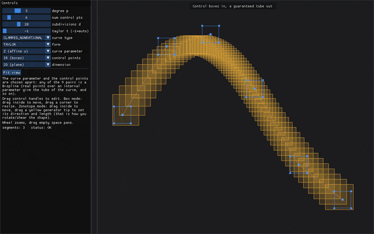
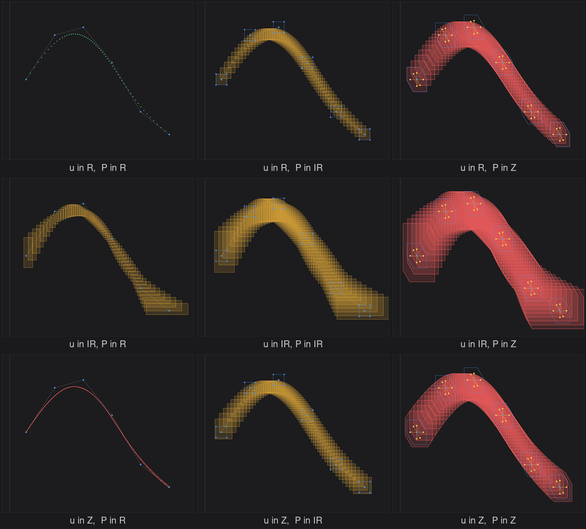
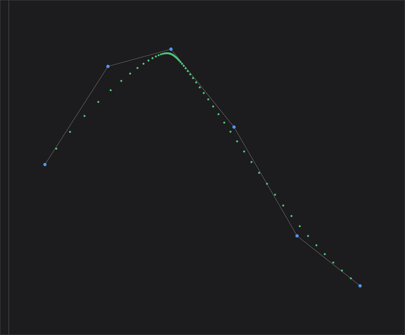
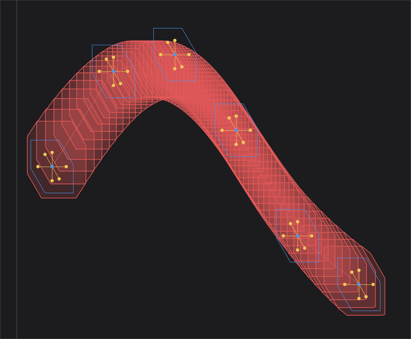
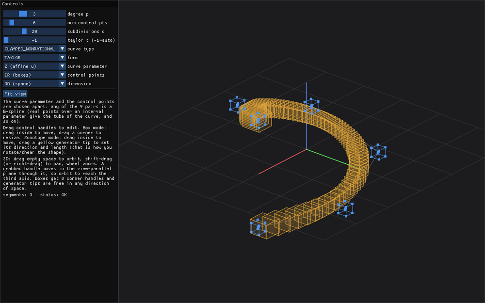
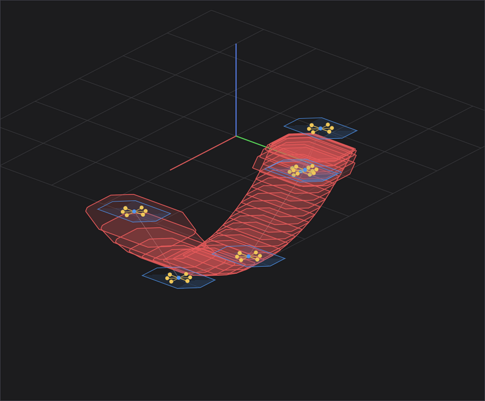

<div align="center">

# SB2L — Set-Based B-spline Library

Uniform and non-uniform, rational and non-rational set-based B-splines, with guaranteed enclosures.

[](LICENSE.txt)
[](CMakeLists.txt)



</div>

## What the library computes

Classical B-splines rely exclusively on real-valued parameters and real-valued control
points, which entails two limitations. First, no enclosure property holds: real values
define a curve with empty interior, incapable of enclosing any set. Second, the
floating-point rounding errors introduced at each evaluation step are neither bounded nor
tracked.

SB2L extends this framework by allowing both the parameter and the control points to take
values in sets. A control point may be a point, a box or a zonotope, and the parameter may
be a real number, an interval or an affine form. The result is a set-valued function which
contains every classical B-spline curve obtained by choosing the parameter in its set and
each control point in its own set. The computations are carried out in interval and affine
arithmetic, and real numbers are represented as degenerate intervals, so the rounding
errors are contained in the result.

The basis functions are built once, by symbolic computation, from the degree and the knot
vector, following the deBoor-Cox recurrence formula. The curve is a linear combination of
the control points, so the basis is calculated once and reused whenever the B-spline is
evaluated over a new set of control points. Changing the set of the parameter, on the
contrary, requires the basis to be built again.

Two evaluation forms are available: the natural extension and the Taylor form. When the
same variable appears multiple times in an expression, interval arithmetic treats each
occurrence independently, which inflates the enclosure; this is the dependency problem.
The Taylor form centers the evaluation around a nominal value and confines the interval
variable to derivative terms, which limits this overestimation.

The construction is presented in full in the paper cited at the end of this file.

## The nine combinations

The set of the parameter and the set of the control points are chosen independently, so
nine combinations are available. Following the paper, each one is named after the
arithmetic of its parameter and the set of its control points: real-box, interval-box,
affine-box, affine-zonotope, and so on.



* First column, real-valued control points: the control points are degenerate sets, so
  the result follows the parameter. Over a real parameter it is the list of evaluated
  points; over an interval parameter, boxes enclosing the curve; over an affine
  parameter, zonotopes enclosing the curve.
* First row, real-valued parameter: the parameter is a discretization, and the result is a
  finite collection of independent evaluations which may not overlap. These are the
  pseudo-interval B-splines: an obstacle may lie between two consecutive evaluations of
  the curve without being detected.
* Second row, interval parameter: a continuous tube enclosing the entire curve. The
  dependency problem inflates its width.
* Third row, affine parameter: the dependencies between the occurrences of the parameter
  are encoded by noise symbols, and the tube is narrower. On this scene, the mean width of
  the resulting sets goes from 0.385 with an interval parameter to 0.263 with an affine
  one.
* Third column, control zonotopes: the dependencies between the control sets are
  preserved, and each element of the result is a zonotope rather than a box.

The affine parameter together with the Taylor form gives the narrowest enclosure, and is
what every other figure of this file uses, with one exception: the rational figure below
is evaluated over a real parameter. The paper also defines affine-polytope
B-splines, obtained as intersections of affine-zonotope B-splines.

## Installation

### With Docker

The image contains every dependency, including the VIBes viewer.

```bash
sudo docker build -t sb2l .
xhost +local:docker
sudo docker run -it --privileged -e DISPLAY=$DISPLAY \
     -v /tmp/.X11-unix:/tmp/.X11-unix --net=host sb2l
```

### From source

Tested on Ubuntu 22.04.

```bash
sudo apt-get install git cmake libgmp-dev python3 flex bison gcc g++ make \
                     pkg-config libfuse2
sudo apt-get install libglfw3-dev libgl1-mesa-dev    # GUI only

git submodule update --init --recursive
mkdir build && cd build
cmake ..
make -j
sudo make install
```

`SymEngine` and `Dear ImGui` are submodules; `DynIbex` is provided under `3rd/`. The option
`-DSB2L_BUILD_GUI=ON` adds the GUI, which requires GLFW and OpenGL.

Every file which computes in interval or affine arithmetic is compiled with
`-frounding-math`, so that the compiler does not fold constants under a rounding mode
which is not the one set at run time, and with `-ffp-contract=off`, so that it does not
fuse a product and a sum into one operation whose intermediate result would escape the
directed rounding. Both are requirements of the arithmetic, not choices of speed, and the
whole library is compiled optimised. `-march=native` is available as
`-DSB2L_NATIVE_ARCH=ON`; it is off by default because it makes the binary unusable on an
older machine.

## Use

```cmake
find_package(sb2l REQUIRED)
target_link_libraries(my_target PRIVATE sb2l symengine gmp)
```

```cpp
#include <sb2l.hpp>

int main()
{
    // 3rd-degree, clamped, non-rational B-spline over an affine parameter,
    // 100 subdivisions per segment, Taylor form of order 1.
    sb2l::SB2 spline(3, 5,
                     sb2l::CurveType::CLAMPED_NONRATIONAL,
                     sb2l::Form::TAYLOR,
                     sb2l::ParameterSet::Z,
                     100, 1);

    // Control points: one container per coordinate, five entries in each.
    std::vector<ibex::IntervalVector> P(2, ibex::IntervalVector(5));
    P[0][0] = ibex::Interval(0, 1);     P[1][0] = ibex::Interval(60, 61);
    P[0][1] = ibex::Interval(50, 60);   P[1][1] = ibex::Interval(100, 120);
    P[0][2] = ibex::Interval(100, 101); P[1][2] = ibex::Interval(60, 61);
    P[0][3] = ibex::Interval(130, 131); P[1][3] = ibex::Interval(22, 23);
    P[0][4] = ibex::Interval(180, 181); P[1][4] = ibex::Interval(30, 31);

    // boxes[s][du] encloses the curve on subdivision du of segment s.
    std::vector<std::vector<ibex::IntervalVector>> boxes = spline.eval_box(P);
}
```

A curve of higher dimension is obtained by passing more containers: each dimension is
independent, the basis is unchanged, and the computational cost grows linearly with the
dimension.

The three evaluations share the same basis, so they may be called on the same object:
`eval_point` for real-valued control points, `eval_box` for boxes, `eval_zonotope` for
zonotopes. Only the last two enclose the curve. `eval_point` returns one point per
subdivision, taken from the middle of the basis, which is the curve itself when the
parameter is real and a representative of the element otherwise.

An element returned by `eval_zonotope` is an affine vector. Its center and its generators
are read with `zonotope_of`, which is also where the error term each coordinate carries
becomes one more generator, so that the zonotope obtained is the whole element.

```cpp
// Control zonotopes: one container per coordinate, as above.
std::vector<ibex::Affine2Vector> Z(2, ibex::Affine2Vector(5));
std::vector<std::vector<ibex::Affine2Vector>> z = spline.eval_zonotope(Z);

sb2l::Zonotope e = sb2l::zonotope_of(z[0][0]);
// e.center[i] and e.gen(k, i): coordinate i of the center and of the generator k.
```

An affine form keeps a bounded number of noise symbols, ten by default, and merges the
smallest ones into its error term beyond that. Control zonotopes built from more
generators are therefore reduced unless `SB2::set_affine_noise_number` raises the
number first.

Every argument of the constructor is checked, and so is the shape of the control points:
an out-of-range degree, number of subdivisions or Taylor order, a missing coordinate,
two coordinates of different lengths, and weights given to a non-rational curve all raise
`std::runtime_error`.

A control point contributes to at most `p + 1` segments, the local support of its basis
function. When only one control point has changed, `impacted_segments(i)` gives that range
and `update_point`, `update_box` and `update_zonotope` recompute it alone, in place.

| Member | Result |
|---|---|
| `get_p()`, `get_n()`, `get_nS()`, `get_d()` | degree, last index of the control points, number of segments, subdivisions |
| `eval_point(P)`, `eval_box(P)`, `eval_zonotope(P)` | the curve, the boxes, the zonotopes, arranged by segment |
| `zonotope_of(v)` | the center and the generators of one evaluated zonotope |
| `impacted_segments(i)` | first and last segment which depend on the control point `i` |
| `update_point/box/zonotope(P, i, out)` | recomputes that range only |
| `get_reBf()`, `get_ieBf()`, `get_aeBf()` | the evaluated basis functions |
| `get_reBf_diff(k)`, `get_ieBf_diff(k)`, `get_aeBf_diff(k)` | their derivative of order `k` |
| `get_rdu()`, `get_idu()`, `get_adu()` | the subdivisions of the parameter |

Weights are given as exact rational numbers, one per control point, and go with a rational
curve type.



*A weight of 6 on the third control point brings the evaluated points onto it; the other
weights are 1.*

The rational basis functions are quotients, and their evaluation over sets, whether from
the parameter or from the control points, widens the enclosure by about one order of
magnitude; refining the subdivisions does not reduce it. Rational B-splines are therefore
best evaluated over a real parameter and real-valued control points.

## Interactive GUI

```bash
mkdir build && cd build
cmake -DSB2L_BUILD_GUI=ON .. && make sb2l_gui -j
./gui/sb2l_gui
```


The degree, the number of control points, the knot vector, the evaluation form and the two
sets are chosen in the panel on the left. A control point is edited directly: a point is
moved, a box is moved from its inside and resized by a corner, a zonotope is moved from
its inside and reshaped by the yellow end of a generator. The shape of a zonotope lies
entirely in its generators, so moving one end turns the set instead of scaling a box.



The `dimension` list moves the curve from the plane to space. The dimension is the number
of containers of control points and the basis does not depend on it, so the change costs
one evaluation.



The view turns when empty space is dragged, and moves when the drag is combined with the
shift key or the right button. A control point which is dragged moves in the plane of the
view passing through it, so the view has to be turned to reach the third direction. A box
offers its eight corners, and the end of a generator may be placed anywhere in space.

A zonotope built from `m` generators is contained in a subspace of dimension `m`: two
generators give a set contained in a plane. The GUI therefore uses at least three
generators in space.



*Four generators per control point, and control points enlarged so that the geometry is
readable: each set of the result is a zonotope of full dimension.*

Calculating the boundary of a resulting set is combinatorial in nature; two properties
keep the display exact and efficient. The projection used by the view is linear, so the
projection of a zonotope is again a zonotope, whose boundary is calculated from the
projected generators. And the boundary of a control zonotope in space is calculated
directly from its pairs of generators, without the convex hull of its vertices.

Every figure of this file is produced by the GUI itself, which the script
below drives; it also needs ImageMagick and gifsicle to assemble them.

```bash
sudo apt-get install imagemagick gifsicle
./docs/make_assets.sh
```

## Examples

```bash
cd examples && mkdir -p build && cd build
cmake .. && make
./basic_example
```

The examples are displayed with [VIBes](https://github.com/ENSTABretagneRobotics/VIBES).
Start `VIBes-viewer/VIBes-0.2.3-linux.AppImage` before running them.

## Reference

The construction, its properties and its evaluation are presented in

> **Set-Based B-Splines with Boxes, Zonotopes and Polytopes.**
> <https://ssrn.com/abstract=7226315>

SB2L is the library provided with that paper, which should be consulted for everything
this file does not cover.

## License and authors

Distributed under the CeCILL-C license, see [LICENSE.txt](LICENSE.txt).

Copyright © 2026 CEA. Developed at CEA / DRT / LIST / DIASI / SRI / LCSR by L. Si Larbi.

The implementation relies on symbolic computation using the
[SymEngine](https://github.com/symengine/symengine) C++ library. Guaranteed floating-point
arithmetic for intervals and zonotopes is provided through the
[DynIbex](https://perso.ensta-paris.fr/~chapoutot/dynibex/) C++ library. The plots of the
examples use [VIBes](https://github.com/ENSTABretagneRobotics/VIBES), and the GUI uses
[Dear ImGui](https://github.com/ocornut/imgui).
